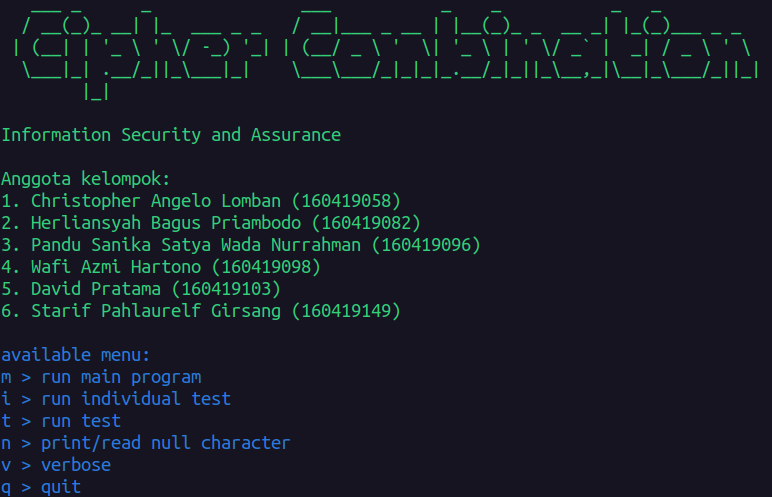
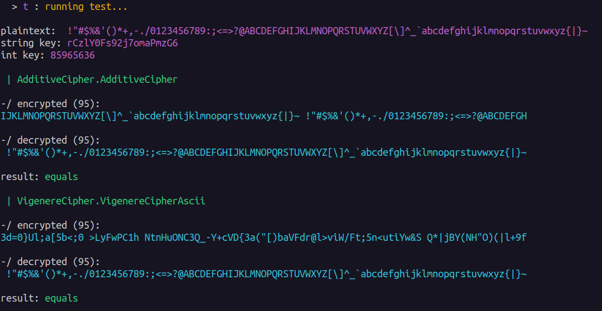
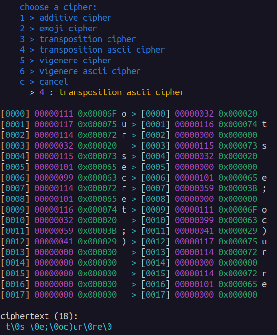
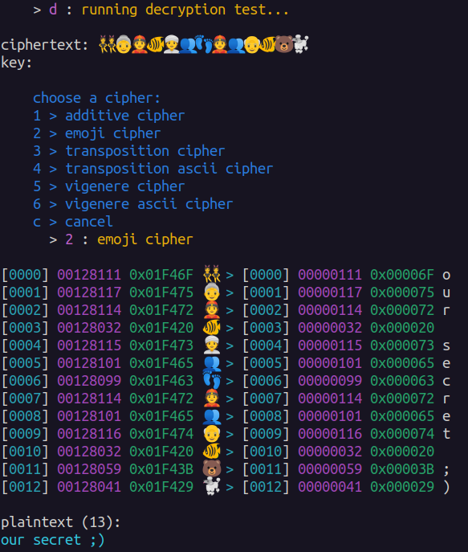

Program kombinasi cipher mata kuliah Information Security and Assurance (1604B045) Teknik Informatika Universitas Surabaya

#### Anggota kelompok

- Christopher Angelo Lomban (160419058)
- Herliansyah Bagus Priambodo (160419082)
- Pandu Sanika Satya Wada Nurrahman (160419096)
- Wafi Azmi Hartono (160419098)
- David Pratama (160419103)
- Starif Pahlaurelf Girsang (160419149)

#### Cipher tersedia

[Additive](AdditiveCipher/), [emoji](EmojiCipher/), [transposition](TranspositionCipher/), [vigenere](VigenereCipher/)

> Catatan untuk cipher emoji: proyeksi emoji dimulai pada karakter Unicode `0x1F420` untuk karakter ASCII `0x20`. Batas bawah proyeksi dapat diatur pada variabel `_codePointStart`. Pastikan 95 karakter Unicode mulai dari batas bawah tersebut (inklusif) adalah karakter yang valid

#### Fitur

- Mendukung karakter ASCII `0x20` sampai `0x7E`

> Untuk cipher additive, transposition dan vigenere, class yang mendukung ASCII adalah yang memiliki nama dengan prefix Ascii

- Menu interaktif

- Input dan output karakter NULL (`0x00`). Fitur ini sangat berguna pada cipher transposition

- Perbandingan plaintext dengan ciphertext karakter demi karakter

#### Screenshots

#### Credits

- [Vigenere cipher](VigenereCipher/VigenereCipher/VigenereCipher.cs): [programmingalgorithms.com](https://www.programmingalgorithms.com/algorithm/vigenere-cipher)

- [Transposition cipher](TranspositionCipher/TranspositionCipher/TranspositionCipher.cs) [programmingalgorithms.com](https://www.programmingalgorithms.com/algorithm/transposition-cipher)
